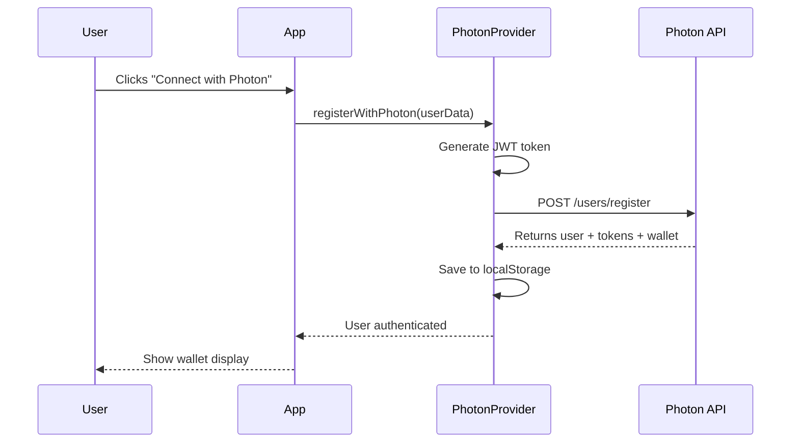

# 🔌 How to Connect to Photon

## 📋 Overview

Photon is already integrated into your PrivatePay project! This guide shows you how to configure and connect to it.

---

## 🚀 Quick Start

### Step 1: Get Photon API Credentials

1. **Sign up for Photon** (if you haven't already)
   - Visit: https://getstan.app or Photon dashboard
   - Create an account
   - Create a new campaign/project

2. **Get your API credentials:**
   - **API Key**: Found in your Photon dashboard settings
   - **Campaign ID**: Found in your campaign/project settings

### Step 2: Add Credentials to .env File

Open `squidl-frontend/.env` and add:

```bash
VITE_PHOTON_API_KEY=your_actual_api_key_here
VITE_PHOTON_CAMPAIGN_ID=your_actual_campaign_id_here
```

**Example:**
```bash
VITE_PHOTON_API_KEY=ph_abc123xyz789
VITE_PHOTON_CAMPAIGN_ID=camp_456def789
```

### Step 3: Restart Frontend

```bash
cd squidl-frontend
# Stop current server (Ctrl+C)
npm run dev
```

---

## 🔧 Current Configuration

### API Base URL
```
https://stage-api.getstan.app/identity-service/api/v1
```

### Configuration Location
- **Config File**: `src/config.js`
- **Service**: `src/api/photonService.js`
- **Provider**: `src/providers/PhotonProvider.jsx`

---

## 📱 How It Works

### 1. **User Registration Flow**

```javascript
// User connects wallet → Generate JWT → Register with Photon
const { registerWithPhoton } = usePhoton();

await registerWithPhoton({
  jwt: "your-jwt-token",
  userId: "user123",
  email: "user@example.com",
  name: "John Doe"
});
```

### 2. **Track Rewarded Events** (User earns PAT tokens)

```javascript
const { trackRewardedEvent } = usePhoton();

await trackRewardedEvent('transfer_completed', {
  amount: 100,
  token: 'USDC',
  chain: 'aptos'
});
// User sees notification: "You earned 5 PAT!"
```

### 3. **Track Unrewarded Events** (Analytics only)

```javascript
const { trackUnrewardedEvent } = usePhoton();

await trackUnrewardedEvent('page_view', {
  page: '/dashboard',
  timestamp: Date.now()
});
// Silent tracking, no notification
```

---

## 🎯 Using Photon in Components

### Example: Connect Button

```jsx
import { PhotonOnboardingButton } from '../components/shared/PhotonOnboardingButton';
import { usePhoton } from '../providers/PhotonProvider';

function MyComponent() {
  const { isAuthenticated, photonUser } = usePhoton();
  
  return (
    <div>
      {!isAuthenticated ? (
        <PhotonOnboardingButton>
          Connect with Photon
        </PhotonOnboardingButton>
      ) : (
        <div>Welcome, {photonUser.name}!</div>
      )}
    </div>
  );
}
```

### Example: Display Wallet

```jsx
import { PhotonWalletDisplay } from '../components/shared/PhotonWalletDisplay';

function Dashboard() {
  return (
    <div>
      <PhotonWalletDisplay />
    </div>
  );
}
```

### Example: Track Events

```jsx
import { usePhoton } from '../providers/PhotonProvider';

function TransferButton() {
  const { trackRewardedEvent } = usePhoton();
  
  const handleTransfer = async () => {
    // ... your transfer logic ...
    
    // Track the event
    await trackRewardedEvent('transfer_completed', {
      amount: transferAmount,
      token: 'USDC',
      chain: 'aptos'
    });
  };
  
  return <button onClick={handleTransfer}>Transfer</button>;
}
```

---

## 🔍 Check Connection Status

### In Browser Console

```javascript
// Check if Photon is configured
console.log(window.PHOTON_CONFIG); // Should show config object

// Check if user is authenticated
const { isAuthenticated, photonUser } = usePhoton();
console.log('Authenticated:', isAuthenticated);
console.log('User:', photonUser);
```

### Visual Indicators

- **Demo Mode**: Shows "🎭 Demo Mode" message if API keys are missing
- **Connected**: Shows wallet address and PAT balance
- **Not Connected**: Shows "Connect with Photon" button

---

## 🎭 Demo Mode

If you don't have API keys yet, Photon runs in **Demo Mode**:

- ✅ UI components still work
- ✅ No real API calls are made
- ✅ Shows demo instructions
- ⚠️ No real rewards or wallet creation

**To enable real functionality:**
1. Get API keys from Photon dashboard
2. Add to `.env` file
3. Restart frontend

---

## 📊 API Endpoints Used

### 1. User Registration
```
POST /users/register
Headers:
  X-API-Key: your_api_key
  Content-Type: application/json
Body:
  {
    "jwt": "your-jwt-token",
    "user_id": "optional-user-id"
  }
```

### 2. Rewarded Event
```
POST /campaigns/events/rewarded
Headers:
  X-API-Key: your_api_key
  Authorization: Bearer access_token
Body:
  {
    "event_id": "unique-id",
    "event_type": "transfer_completed",
    "user_id": "user123",
    "campaign_id": "campaign_id",
    "timestamp": "2024-01-01T00:00:00Z",
    "metadata": {}
  }
```

### 3. Unrewarded Event
```
POST /campaigns/events/unrewarded
Headers:
  X-API-Key: your_api_key
  Authorization: Bearer access_token
Body: (same as rewarded event)
```

### 4. Token Refresh
```
POST /auth/refresh
Headers:
  X-API-Key: your_api_key
Body:
  {
    "refresh_token": "refresh_token_here"
  }
```

---

## 🔐 Authentication Flow



---

## 🛠️ Troubleshooting

### Issue: "Photon is not configured"
**Solution**: Add API keys to `.env` file

### Issue: "Failed to register user"
**Solution**: 
- Check API key is correct
- Verify JWT token is valid
- Check network connection

### Issue: "Token expired"
**Solution**: 
- PhotonProvider automatically refreshes tokens
- If refresh fails, user needs to reconnect

### Issue: "Demo mode" showing
**Solution**: 
- Verify `.env` file has correct variable names
- Restart dev server after adding keys
- Check keys don't have quotes or spaces

---

## 📝 Environment Variables

### Required (for real functionality):
```bash
VITE_PHOTON_API_KEY=your_api_key_here
VITE_PHOTON_CAMPAIGN_ID=your_campaign_id_here
```

### Optional:
- None currently

---

## 🔗 Key Files

| File | Purpose |
|------|---------|
| `src/config.js` | Photon configuration |
| `src/api/photonService.js` | API service layer |
| `src/providers/PhotonProvider.jsx` | State management |
| `src/components/shared/PhotonWalletDisplay.jsx` | Wallet UI |
| `src/components/shared/PhotonOnboardingButton.jsx` | Connect button |
| `src/utils/photonStorage.js` | LocalStorage helpers |

---

## ✅ Verification Checklist

- [ ] Photon API key obtained
- [ ] Campaign ID obtained
- [ ] Added to `.env` file
- [ ] Restarted frontend server
- [ ] No "Demo Mode" message showing
- [ ] Can see "Connect with Photon" button
- [ ] Can register user successfully
- [ ] Can see wallet display after connection
- [ ] Events are tracking correctly

---

## 🎉 Next Steps

1. **Get API Keys** from Photon dashboard
2. **Add to .env** file
3. **Test Connection** using PhotonOnboardingButton
4. **Track Events** in your components
5. **Display Wallet** using PhotonWalletDisplay

---

## 📚 Additional Resources

- **Photon Documentation**: Check Photon dashboard for API docs
- **Integration Guide**: See `PHOTON_INTEGRATION.md` in project
- **Service Code**: See `src/api/photonService.js` for implementation

---

**Need Help?** Check the browser console for detailed error messages and logs.

