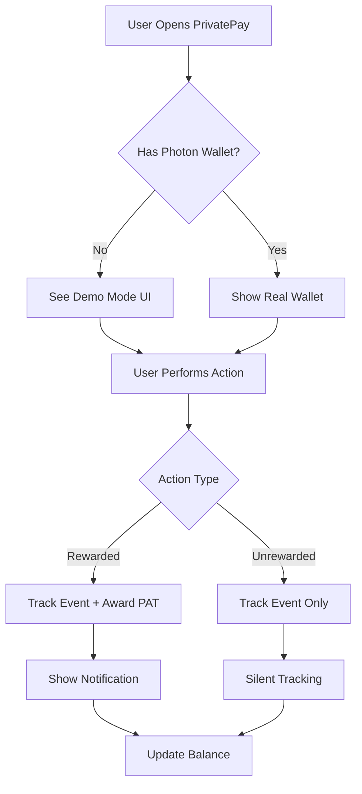
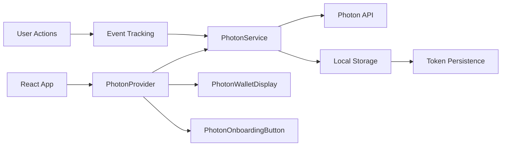
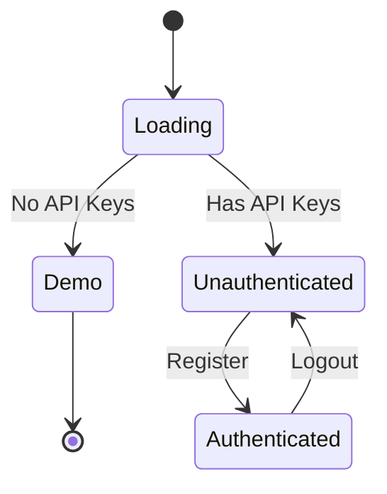
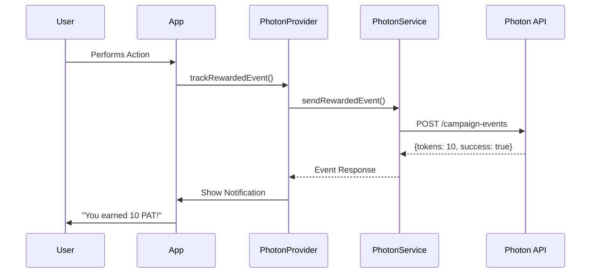
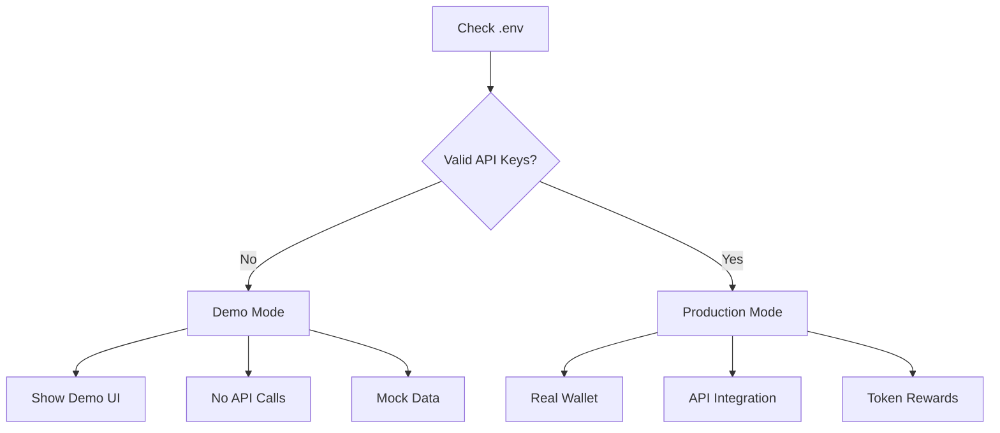
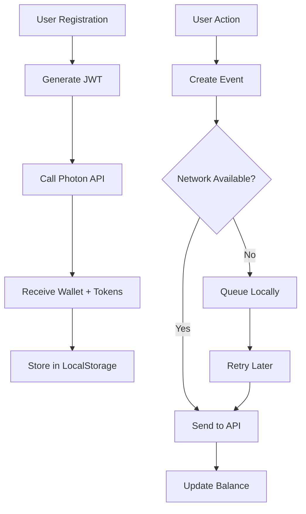
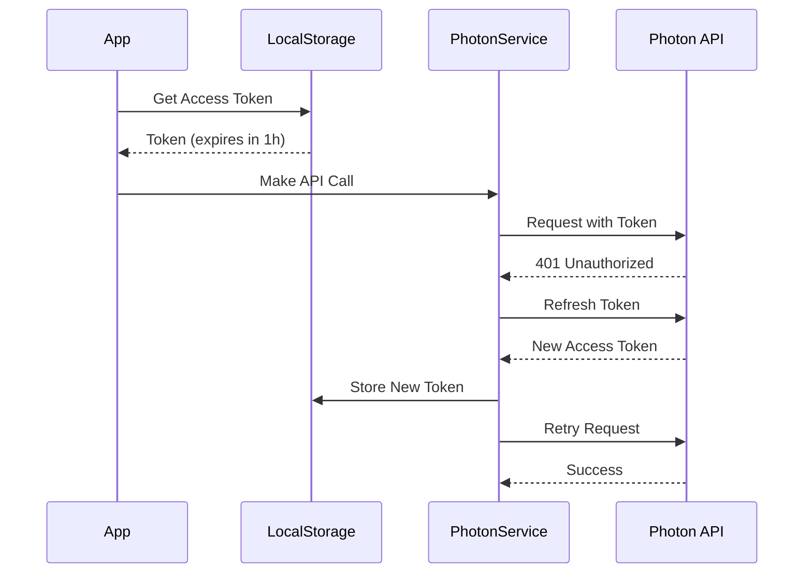
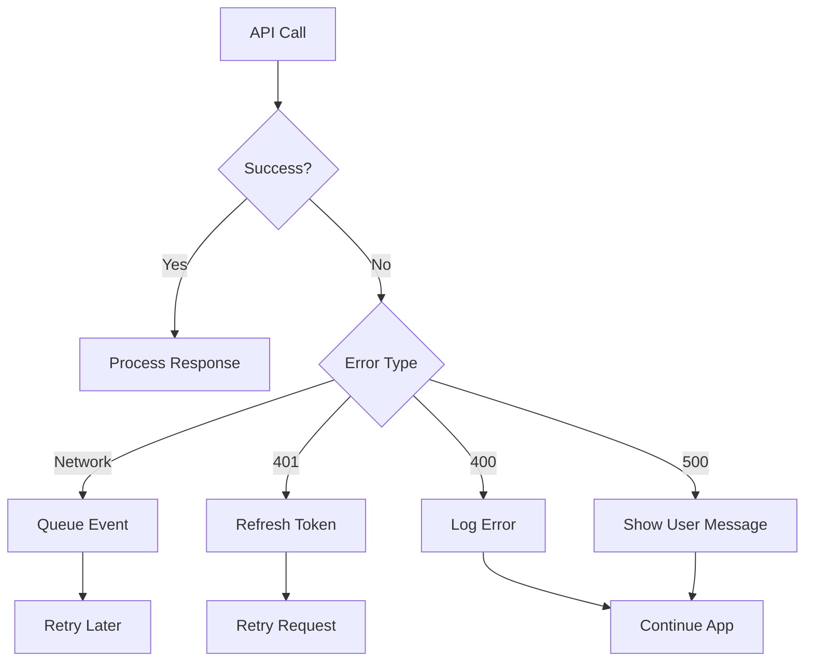

# Photon Integration in PrivatePay

## What is Photon?

Photon is a rewards and engagement platform that provides:
- Embedded wallet creation for users
- PAT token rewards for user actions
- Event tracking and analytics
- Passwordless authentication

## How Photon Works in PrivatePay



## Architecture



## Key Components

### 1. PhotonProvider
Context provider that manages:
- User authentication state
- Wallet information
- Event tracking functions
- Token refresh logic



### 2. PhotonWalletDisplay
Shows user's Photon wallet:
- Wallet address
- PAT token balance
- Demo mode instructions (when no API keys)

### 3. PhotonOnboardingButton
Triggers user registration:
- Creates embedded wallet
- Generates JWT token
- Stores access tokens

### 4. Event Tracking



## Event Types

### Rewarded Events
Actions that earn PAT tokens:
- Completing transfers
- Making payments
- Bridging assets
- First-time actions

### Unrewarded Events
Actions tracked for analytics:
- Page views
- Button clicks
- Feature usage
- User behavior

## Demo Mode vs Production Mode



### Demo Mode
- Displays UI components
- Shows placeholder data
- No API calls made
- Helps with development

### Production Mode
- Real wallet creation
- Actual token rewards
- Full API integration
- Requires valid API keys

## Data Flow



## Token Management



## Error Handling



## Configuration

### Environment Variables
```env
VITE_PHOTON_API_KEY=your_api_key
VITE_PHOTON_CAMPAIGN_ID=your_campaign_id
```

### Config Structure
```javascript
PHOTON_CONFIG = {
  apiBaseUrl: "https://stage-api.getstan.app/...",
  apiKey: process.env.VITE_PHOTON_API_KEY,
  campaignId: process.env.VITE_PHOTON_CAMPAIGN_ID,
  enabled: true,
  isDemo: !hasValidKeys
}
```

## Usage Example

### Track a Rewarded Event
```javascript
const { trackRewardedEvent } = usePhoton();

await trackRewardedEvent('transfer_completed', {
  amount: 100,
  token: 'USDC',
  chain: 'ethereum'
});
// User sees: "You earned 5 PAT!"
```

### Track an Unrewarded Event
```javascript
const { trackUnrewardedEvent } = usePhoton();

await trackUnrewardedEvent('page_view', {
  page: '/dashboard',
  timestamp: Date.now()
});
// Silent tracking, no notification
```

## File Structure

```
src/
├── api/
│   └── photonService.js          # API calls
├── components/
│   └── shared/
│       ├── PhotonWalletDisplay.jsx
│       ├── PhotonOnboardingButton.jsx
│       └── PhotonErrorBoundary.jsx
├── providers/
│   └── PhotonProvider.jsx        # State management
├── utils/
│   ├── photonStorage.js          # LocalStorage
│   ├── photonEventQueue.js       # Event queue
│   └── jwtGenerator.js           # JWT creation
└── config.js                     # Configuration
```

## Benefits

1. **User Engagement**: Reward users for actions
2. **Analytics**: Track user behavior
3. **Wallet Management**: Automatic wallet creation
4. **Token Economy**: PAT token rewards
5. **Easy Integration**: Drop-in components

## Limitations

- Requires internet connection for rewards
- Demo mode doesn't award real tokens
- API keys needed for production
- Token refresh every hour

## Future Enhancements

- Batch event processing
- Offline queue improvements
- Custom reward rules
- Advanced analytics dashboard
- Multi-campaign support
